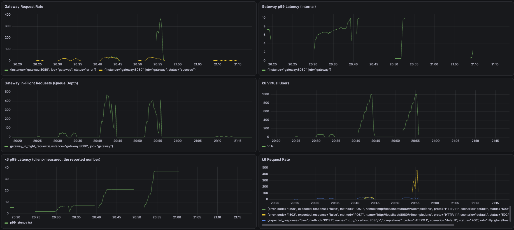

# Scalable LLM Inference Platform

A production-grade inference platform for quantized large language models (LLMs), demonstrating infrastructure skills in serving, scaling, observability, and cost optimization.

## Overview

This project serves an AWQ INT4-quantized Mistral-7B via vLLM behind a FastAPI gateway (API-key auth, per-key rate limiting, concurrency backpressure, SSE streaming), with observability (Prometheus + Grafana), orchestrated via Docker Compose, and load-tested with k6 on a real GPU to measure real-world performance.

**Actual deployment:** Single GPU (NVIDIA L4, 24GB VRAM) with concurrent request handling — ~308 tokens/sec and p99=1910ms at 10 concurrent users, ~256-300 concurrent users supported, and ~19x faster perceived responsiveness (time-to-first-token) via streaming. Full results: [Benchmark Results](#benchmark-results).

## Quick Start

### Prerequisites
- A Linux host with an NVIDIA GPU for vLLM (tested on an L4, 24GB) and **Python 3.10+** there (vLLM does not import on 3.9)
- Docker and Docker Compose for the gateway, Prometheus and Grafana (the gateway image itself runs Python 3.9)
- [k6](https://k6.io) for load tests

This is the path that was actually run and measured. The step-by-step runbook, including what to watch during load tests, is in [`DEPLOYMENT.md`](DEPLOYMENT.md).

### 1. Start vLLM on the GPU host

```bash
git clone https://github.com/ZhangHaopu/llm-inference-platform.git
cd llm-inference-platform
python3 -m venv venv && source venv/bin/activate
pip install -r requirements.txt

# Serves TheBloke/Mistral-7B-Instruct-v0.1-AWQ on :8000 (downloads weights on first run)
python src/serving/vllm_server.py
```

Tunable flags: `--gpu-memory-utilization`, `--max-model-len`, `--max-num-seqs`.

### 2. Start the gateway and monitoring

On any machine with Docker, pointed at the vLLM host:

```bash
export API_KEYS="key1,key2"                    # comma-separated valid API keys
export VLLM_URL="http://<gpu-host>:8000"       # host.docker.internal:8000 if using an SSH tunnel
export MAX_CONCURRENT_REQUESTS=150             # optional, gateway concurrency cap (default 10)

docker compose -f docker/docker-compose.yml up -d --build --no-deps gateway prometheus grafana
```

Gateway on `:8080`, Prometheus on `:9090`, Grafana on `:3000` (`admin` / `admin`; add a Prometheus data source at `http://prometheus:9090`).

### 3. Send a request

```bash
curl -N -X POST http://localhost:8080/v1/completions \
  -H "Content-Type: application/json" -H "X-API-Key: key1" \
  -d '{"model":"TheBloke/Mistral-7B-Instruct-v0.1-AWQ","prompt":"What is machine learning?","max_tokens":50,"stream":true}'
```

Set `"stream": false` for a single JSON response.

### 4. Load test and benchmark

```bash
# One API key per virtual user, so the per-key rate limiter doesn't dominate the results
API_KEYS="k1,k2,k3,k4,k5,k6,k7,k8,k9,k10" MODEL="TheBloke/Mistral-7B-Instruct-v0.1-AWQ" \
  k6 run -o experimental-prometheus-rw loadtest/load_test.js

# Naive generate() baseline vs vLLM, from the repo root on the GPU host
# (results are written to benchmarks/baseline.json and benchmarks/vllm.json)
python src/serving/benchmark_baseline.py
python src/serving/benchmark_vllm.py --model TheBloke/Mistral-7B-Instruct-v0.1-AWQ
python src/serving/compare_benchmarks.py
```

The `vllm` service in `docker-compose.yml` (all-in-one on a GPU host with the NVIDIA Container Toolkit) is defined but was not exercised during testing; vLLM was run directly on the GPU host as above.

## Architecture

```
┌─────────────────────────────────────────────────────────────┐
│                       Client Requests                        │
└────────────────┬────────────────────────────────────────────┘
                 │
        ┌────────▼────────┐
        │   FastAPI       │
        │   Gateway       │ (API-key auth, rate limiting,
        │                 │  backpressure, SSE streaming)
        └────────┬────────┘
                 │
        ┌────────▼────────┐
        │   vLLM Server   │ (Continuous batching,
        │                 │  PagedAttention)
        └────────┬────────┘
                 │
        ┌────────▼────────┐
        │ Mistral-7B AWQ  │
        │  (INT4)         │
        └─────────────────┘

        Observability: Prometheus → Grafana
```

## Benchmark Results

Measured on a rented NVIDIA L4 (24GB), AWQ-quantized Mistral-7B served via
vLLM. Full methodology, all 11 experiments, and how each number was derived:
[`benchmarks/EXPERIMENTS.md`](benchmarks/EXPERIMENTS.md).

| Metric | Value |
|--------|-------|
| Throughput (10 concurrent users) | ~308 tokens/sec (vs 37.54 tok/s naive sequential baseline — ~8x) |
| p50 Latency (10 concurrent users) | 1580 ms |
| p99 Latency (10 concurrent users) | 1910 ms |
| Time-to-first-token (streaming, avg) | 78.8 ms (vs 1497 ms non-streaming — ~19x) |
| Concurrent Users Supported | ~256-300 (vLLM's own scheduler limit, confirmed via its internal metrics) |
| GPU Memory Usage | ~20.4 GB / 23 GB (L4) |



## Project Structure

```
llm-inference-platform/
├── README.md
├── DEPLOYMENT.md              # GPU deployment runbook
├── requirements.txt           # GPU host dependencies (pinned)
├── requirements-gateway.txt   # Gateway image dependencies (pinned)
├── src/
│   ├── gateway/               # FastAPI gateway
│   │   ├── app.py             # Proxy, backpressure, streaming, metrics
│   │   ├── auth.py            # API-key auth
│   │   └── rate_limit.py      # Per-key token bucket
│   └── serving/               # vLLM launcher, model loading, benchmarks
│       ├── vllm_server.py
│       ├── model_loader.py
│       ├── benchmark_baseline.py
│       ├── benchmark_vllm.py
│       └── compare_benchmarks.py
├── docker/
│   ├── Dockerfile             # Gateway image
│   └── docker-compose.yml     # vLLM, gateway, Prometheus, Grafana
├── monitoring/
│   ├── prometheus.yml
│   └── grafana-dashboards/
├── loadtest/                  # k6 scripts: fixed load, stress staircases, TTFT
└── benchmarks/                # Raw results and the 11-experiment log
    └── EXPERIMENTS.md
```

## Development Progress

### Step 1: Model Quantization
- [x] Download Mistral-7B-Instruct INT4 (AWQ pre-quantized, for vLLM; bitsandbytes on-the-fly NF4 for the baseline path)
- [x] Verify model loads and generates text
- [x] Benchmark baseline tokens/sec — 37.54 tok/s

### Step 2: vLLM Integration
- [x] Add a vLLM server launcher for CUDA/Linux hosts
- [x] Add a sequential client benchmark for the vLLM endpoint
- [x] Add a baseline-vs-vLLM comparison script
- [x] Replace naive `generate()` with vLLM server
- [x] Measure throughput improvement — 59.74 tok/s sequential (1.59x), ~308 tok/s at 10 concurrent users (~8x)

### Step 3: FastAPI Gateway
- [x] Request validation (Pydantic) and async proxy to vLLM
- [x] API-key authentication
- [x] Rate limiting
- [x] Async queue / backpressure handling
- [x] Streaming responses (SSE) — ~19x better time-to-first-token vs non-streaming

### Step 4: Containerization
- [x] Dockerfile for model + API
- [x] Docker Compose orchestration

### Step 5: Observability
- [x] Prometheus metrics (latency, throughput, queue depth)
- [x] Grafana dashboard

### Step 6: Load Testing & Tuning
- [x] k6 load tests — fixed-load and staircase stress tests up to 1000 concurrent users
- [x] p50/p95/p99 latency benchmarks
- [x] Batch size / scheduler tuning — found and confirmed vLLM's real concurrency ceiling (`max-num-seqs=256`)

### Step 7: Polish & Publish
- [ ] Final README, commit history
- [ ] Push to GitHub
- [ ] CI workflow (optional)

## Next Steps

- [ ] Benchmark against other inference frameworks (llama.cpp, TensorRT)
- [ ] Add Kubernetes manifests for autoscaling
- [ ] Quantize other models (Llama-3, Mixtral)
- [ ] Fine-tuning pipeline integration
